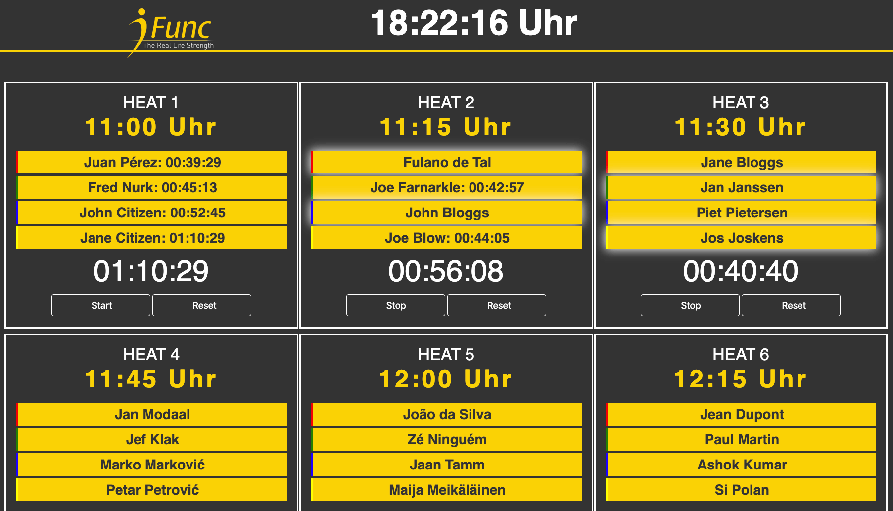
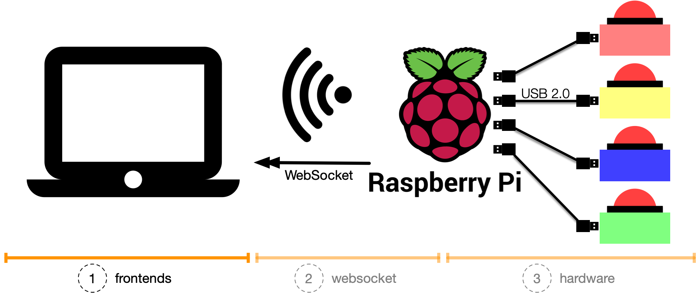

# things with buzzers: sports competition

A sports competition frontend for _things with buzzers_.

> For more context, we recommend reading [things with buzzers: building them](https://andygrunwald.com/blog/things-with-buzzers-building-them/) and [things with buzzers: a sports competition](https://andygrunwald.com/blog/things-with-buzzers-a-sports-competition/).

  

Used in a local functional fitness gym ([iFunc](https://www.ifunc.de/)) for a [Hyrox](https://hyrox.com/) pre-event.

  

_You are missing the context, what this is all about?_
Have a look at

* [(1) things with buzzers: Jeopardy! frontend](https://github.com/andygrunwald/things-with-buzzers-jeopardy)
* [(2) things with buzzers: websocket](https://github.com/andygrunwald/things-with-buzzers-websocket)
* [(3) things with buzzers: hardware](https://github.com/andygrunwald/things-with-buzzers-hardware)

## Features

* Stopwatch per heat
* Stopwatch is stopping automatically, once all heat athletes finished
* Clickable names to indicate which athletes time should be stopped next (e.g., if someone outpaces another athlete)
* Scoreboard to see who is the fastest athlete

## Limitations

The scoreboard is 100% static.
No data is persisted at the server.

## Usage and deployment

This frontend should be used in combination with [things with buzzers: websocket](https://github.com/andygrunwald/things-with-buzzers-websocket).

1. Install [things with buzzers: websocket](https://github.com/andygrunwald/things-with-buzzers-websocket)
2. Clone this repository into the `/static/` folder: `git clone git@github.com:andygrunwald/things-with-buzzers-sports-competition.git static/twb-sports-competition/`
3. Start the `twb-websocket` binary
4. Open a browser and visit http://192.168.4.1/static/twb-sports-competition/index.html
5. Enjoy!